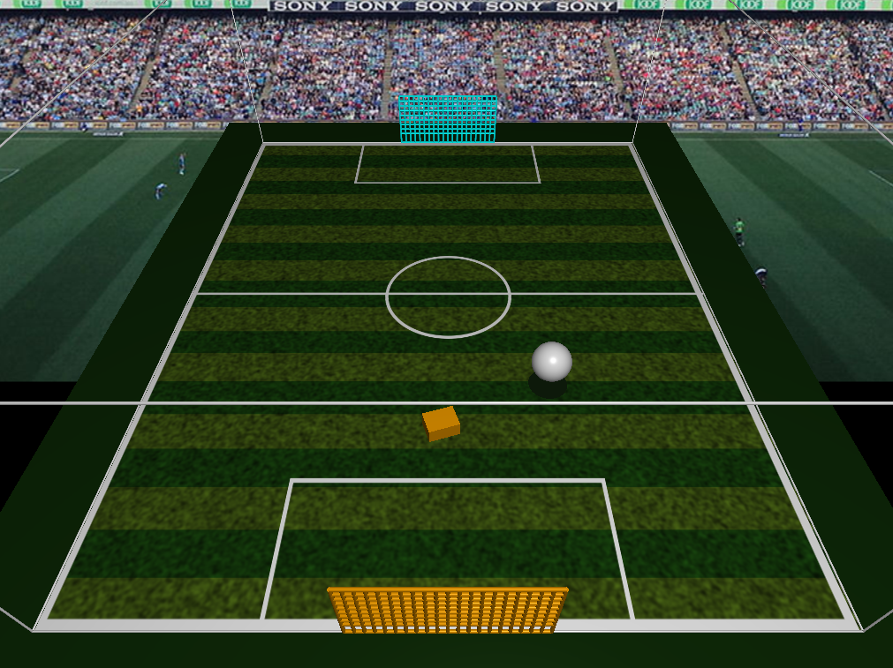

<h3>CSCI 4611 Assignment 2: Car Soccer</h3>
<h4>Brian Cooper</h4>

</img>

## Program Overview
This assignment involves a small playing field with a ball and car (somewhat reminiscent of _Rocket League_ by Psyonix) and involves rudimentary game physics. The goal is to score the ball into a goal. Various design decisions and features of the program are described below, as well as how to run the program.

## Compiling and Running
To compile the program, navigate to the `build` directory and type `make` in a terminal.

To run the program, type `./a2-carsoccer` in a terminal after the program has been built.

## Program Design

#### Outline
The objective of the game is to score the ball into either goal. After the ball enters a goal, the simulation will reset (the position of the car and ball will return to their initial positions).

#### Car Mechanics
The car has counteracting _thrust_ and _drag_ forces. By pressing the `↑` (up arrow) key, the thrust force will increase in effect and propel the car forwards. By pressing the `↓` (down arrow) key, the car will thrust backwards. While neither key is being pressed, the drag force will begin to kick in and slow the car down (eventually to a stop if no arrow key intervention occurs).

#### Ball Mechanics
The ball always begin in the air in the center of the pitch, but the direction of travel is somewhat random. The direction will always approach the car's initial position. The ball has a larger-than-life acceleration due to gravity of 12.8 meters per second downwards to allow a smoother gameplay experience.

## Extra Features

#### Ball Reset
By pressing the `spacebar`, the ball's position will reset and be sent generally in the positive-z direction (towards the car's initial position), but the car's current position will remain the same. This mechanic is also described under _Ball Mechanics_ above.
