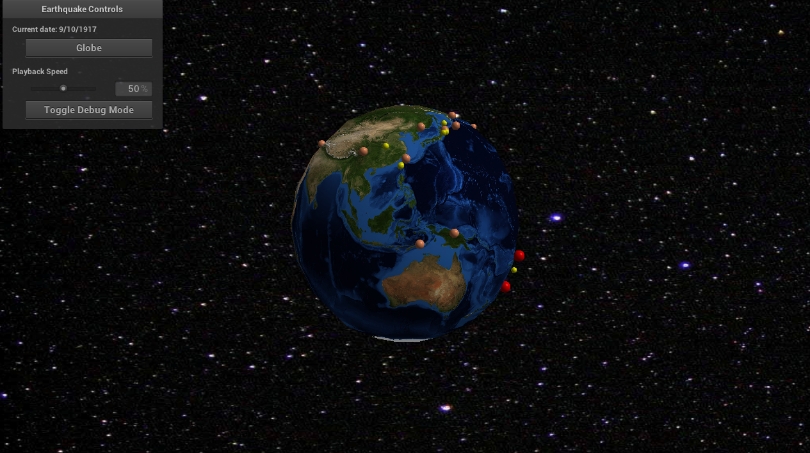

<h3>CSCI 4611 Assignment 3: Earthquakes</h3>
<h4>Brian Cooper</h4>

</img>

## Program Overview
This program uses data from NASA (image of Earth) and USGS (earthquake data) to visualize earthquakes over time. The earthquakes are represented as small spheres on the surface of the earth, and their color and size represents their magnitude, which is based on their <a href="http://www.geo.mtu.edu/UPSeis/magnitude.html">magnitude class</a>. In detail, the classes and their corresponding magnitudes, sizes, and colors are:

<table style="text-align:center">
    <th>Class</th>
    <th>Magnitude</th>
    <th>Size</th>
    <th>Color</th>
  <tr>
    <td>Great</td>
    <td>8+</td>
    <td>Large</td>
    <td>Red</td>
  </tr>
  <tr>
    <td>Major</td>
    <td>7 - 7.9</td>
    <td>Medium</td>
    <td>Orange</td>
  </tr>
  <tr>
    <td>Strong</td>
    <td>6 - 6.9</td>
    <td>Small</td>
    <td>Yellow</td>
  </tr>
  <tr>
    <td>Moderate</td>
    <td>5 - 5.9</td>
    <td>Tiny</td>
    <td>Green</td>
  </tr>
</table>

The other two classes, "Light" and "Minor", do not appear in the data.

## Compiling and Running
To compile the program, navigate to the `build` directory and type `make` in a terminal.

To run the program, type `./a3-earthquake` in a terminal after the program has been built.

## Mode Toggle
The earthquake data can be visualized as a plane (default) or as a sphere (globe). This mode can be changed by clicking the `Globe` button in the interactive GUI menu on the top left of the program. In globe mode, the earth rotates over time.

## Playback Speed
The earthquakes are rendered automatically as soon as the program is launched, but the speed of the visualization can be controlled by altering the `Playback Speed` slider in the middle of the menu. By default, this is at `50%`.

## Debug Mode
By clicking the `Toggle Debug Mode` in the button menu, the triangle mesh (generated by vertex and index buffers) can be viewed. This is viewable in both plane and globe mode.
