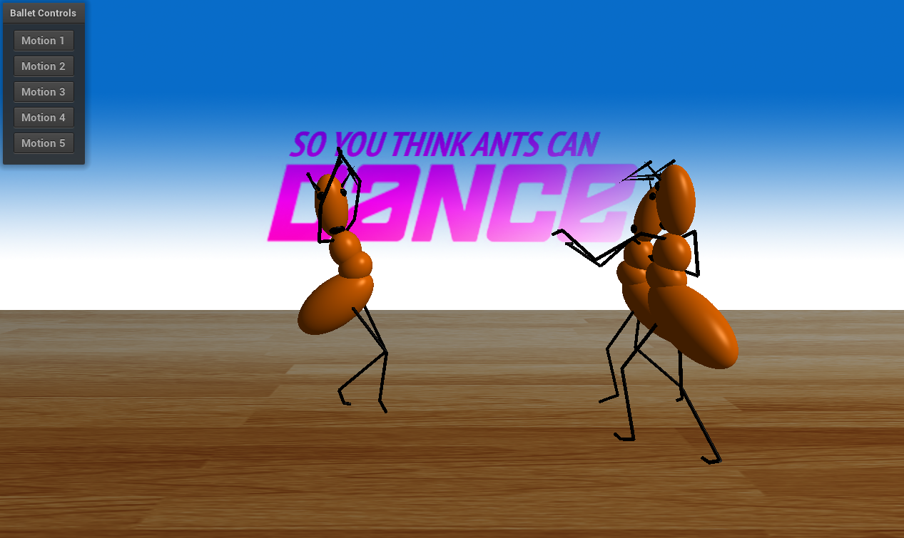

<h3>CSCI 4611 Assignment 4: So You Think Ants Can Dance</h3>
<h4>Brian Cooper</h4>

</img>

## Program Overview
This program uses motion capture data from the Carnegie Mellon motion capture database (http://mocap.cs.cmu.edu/) to animate three ants. Two ants (right side of screen) are performing the salsa dance together, while one ant (left side of screen) can be interacted with. A menu on the left side of the program involves five different motion settings which involve trimmed motion clips from the CMU database. Clicking any of these five buttons will cause the left ant to perform the respective motion. The corresponding motion files as they exist in the database are:
- __Motion 1:__ `05_02.amc`
- __Motion 2:__ `05_10.amc`
- __Motion 3:__ `05_09.amc`
- __Motion 4:__ `05_20.amc`
- __Motion 5:__ `05_06.amc`

Keep in mind that some of these motions may cause the ant to move significantly -- this behavior is further described below.

## Viewport Escaping
It is important to note that some motions on the interactive ant (left side of screen) drastically move the ant's position. This may cause the ant to be clipped out of the window (partially or entirely). To fix this, make use of motion 4 to go significantly "backwards" (away from camera), and motions 1 and 5 to go significantly "forwards" (towards camera). This can alternatively be fixed by restarting the simulation.
