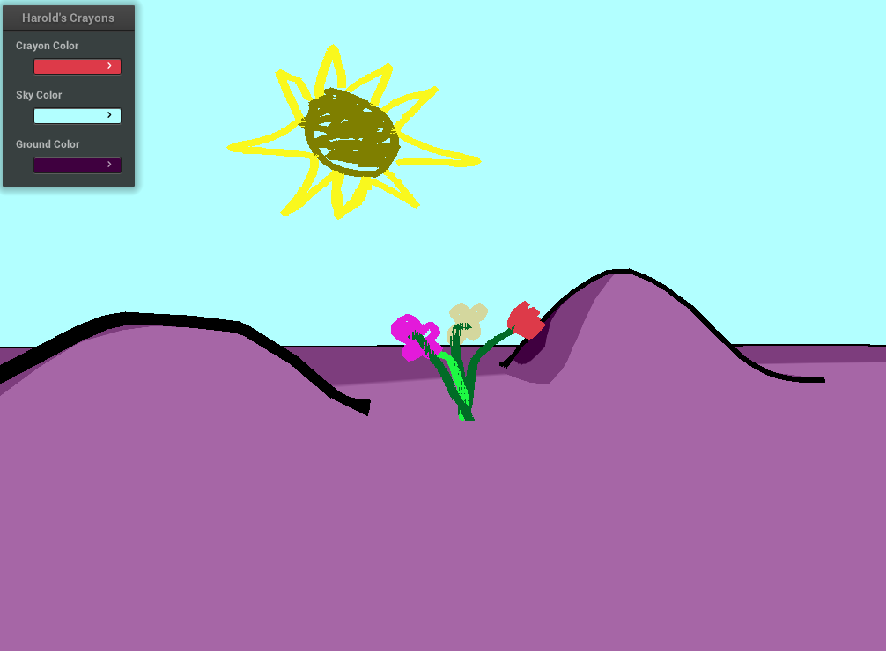

<center>
<h3>CSCI 4611 Assignment 6: Harold</h3>
<h4>Brian Cooper</h4>
<hr>
</img>
</center>

## Program Overview
This program implements a 3D, interactive world inspired by Crockett Johnson's *Harold and the Purple Crayon* children's book. Strokes can be painted in the sky, as well as ground topology and features.

## Compiling and Running
To compile and run the program, execute
```sh
make && ./a6-harold
```
from within a directory called `build` within the main project directory. Note that this requires Cmake initialization before any of these steps are possible.

## Usage
Upon running the program, an interface is presented with three options:
  1. **Crayon Color:** Set the current crayon color for drawing
  2. **Sky Color:** Set the current sky color
  3. **Ground Color:** Set the color of the ground

Upon clicking any of the three color boxes, an RGB selector is presented that allows color selection.

## Controls
The arrow keys and keys `W`, `A`, and `S` can be used to control the character's movement.

Clicking with the mouse allows drawing. Drawing in the sky creates a stroke in the sky, drawing on the ground (start to end) terraforms the ground, drawing from ground to sky creates a "billboard", and drawing on a billboard adds the drawn stroke to that billboard.
